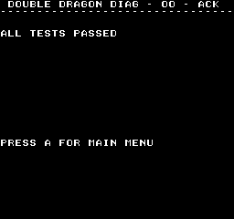
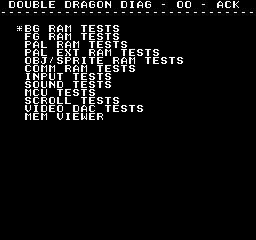
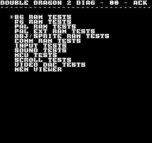

# ddragon-diag
This is a diagnostics program that will compile to 2 different rom images, one that can run on the original double dragon (ddragon-diag.bin) and one that can run on double dragon 2 (ddragon2-diag.bin) jamma/arcade boards. Its a similar concept as the [neogeo-diag-bios](https://github.com/jwestfall69/neogeo-diag-bios).

It is targeted to the HD6309 CPU and will not work on bootleg boards that have a 6809 as the main CPU.

#### Double Dragaon

#### Double Dragaon 2

## Pre-Built
You can grab the latest build from the main branch at

https://www.mvs-scans.com/ddragon-diag/ddragon-diag-main.zip

## Usage: Double Dragaon
#### MAME
Copy ddragon-diag.bin over 21j-1-5.26 rom file in ddragon, and fire up ddragon.

#### Hardware
Burn the ddragon-diag.bin to a 27C256 or a 27c512 (if you double it up).  Install the eprom into IC26.  As for other eproms at a minimum you will want the following install

CPU Board:
* IC20 / 21J-5 (char rom)
* IC30 / 21J-0 (sound program rom, if you want beep codes)
* IC101 / 21JK-0 (prom)

Graphics Board:
* IC16 / 21JL-0 (prom)
* IC78 / 21J-8 (tiles)
* IC109 / 21J-I (tiles)

You can technically run it without any of the graphics/char/prom roms, but the screen will be blank.  All you can get (if your sound works) is beep codes or the all tests passed jingle.

If you want to play PCM sounds on the sounds test screen, you will also need to install IC94 / 21J-7 and IC95 / 21J-6 on the CPU board.

The IC38 / MCU on the CPU board it not required for the ddragon-diag to function, but it missing will trigger a failure if you run the MCU tests.

## Usage: Double Dragon 2
#### MAME
Copy ddragon2-diag.bin over 26a9-04.bin rom file in ddragon2, and fire up ddragon2.
#### Hardware

## Building
Building requires vasm (vasm6809_oldstyle) and vlink which are available here

http://sun.hasenbraten.de/vasm/ 
http://sun.hasenbraten.de/vlink/

For the time being you must use the nightly build of vasm as there are a couple bugs in 1.8k that cause problems when building for the 6309 CPU.

Running make should generate ddragon-diag.bin and ddragon2-diag.bin in the bin/ dir
