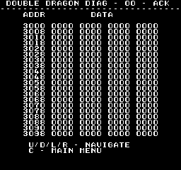

# Mem Viewer
---
This test lets you view memory.

* Up/Down will scroll up/down one line
* Left/Right will page up/down

The displayed memory range is continually being read and screen updated to
reflected any changes that maybe occurring.

### Memory Ranges
Useful memory locations (From MAME)

| Start Address | End Address | Description    |
|--------------:|------------:|:---------------|
|        0x0000 |      0x0fff | Work Ram       |
|        0x1000 |      0x11ff | Pal Ram        |
|        0x1200 |      0x13ff | Pal Ext Ram    |
|        0x1800 |      0x1fff | FG Ram         |
|        0x2000 |      0x21ff | Comm Ram       |
|        0x2800 |      0x29ff | OBJ/Sprite Ram |
|        0x3000 |      0x37ff | BG Ram         |
|        0x3800 |      0x3800 | P1 Input       |
|        0x3801 |      0x3801 | P2 Input       |
|        0x3802 |      0x3802 | Extra Input    |
|        0x3803 |      0x3803 | Dip Switch0    |
|        0x3804 |      0x3804 | Dip Switch1    |
|        0x3808 |      0x3808 | Bankswitch     |
|        0x3809 |      0x3809 | Scrollx        |
|        0x380a |      0x380a | Scrolly        |
|        0x380b |      0x380f | Interrrupts    |
|        0x4000 |      0x7fff | Rom @ IC25     |
|        0x8000 |      0xffff | Diag Rom (IC26)|
