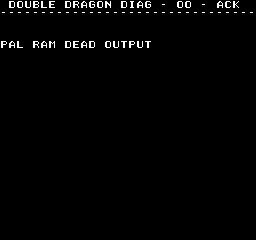
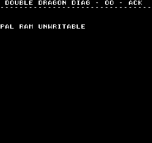
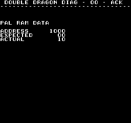
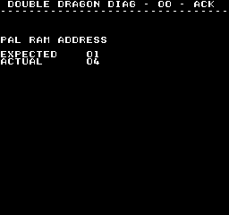

# Ram Tests
---
The same set of ram tests are run against each of the different ram chips the
CPU has access to.

The CPU doesn't have direct access to ram, like it does with the program roms.
All access is going to go through multiple 74 series logic ICs.

NOTE: In order to get some easy screen shots of the different errors I just
forced the error condition in MAME.  If the PAL ram was having an issue on real
hardware the colors on the screen would not be black/white.

#### Data Lines
CPU <=> 74LS245 (IC12) <=> 74LS245 (near ram chip) <=> ram

#### Address Lines
CPU => 2x 74F244 (IC40/IC56) => multiple 74LS153s or 74LS174s (near ram chip) => ram

If you get a ram related error you need to take this in to consideration as one
of those 74 series logic ICs maybe the fault and not the ram chip.

If IC12, IC40, or IC56 are bad you will likely just get a static screen of
garbage because the CPU can't access anything other then the diag rom.  You
will also likely not get any beep code because talking to the sound CPU is also
dependent on those ICs.

#### Ram Specific Notes
* Work and FG ram are on the same physical ram chip (IC21)
* Work ram tests uses different code then all the other ram chips.  It tests the
same things, but requires special code because we can't use work ram (ie: jsr/rts or
stack usage is not allowed)
* PAL ram, the upper 4 bits are green, lower 4 bits are red
* PAL extended ram is only 4 bit, containing blue's 4 bits

#### Automatic vs Manual Tests
Automatic tests run on boot (unless C is held down) and will run each of the ram
tests once on each of the ram types.  With manual tests you pick a specific ram
type to test from the main menu and it will continually test that ram over and
over until you stop it by pressing C.  Work ram manual testing is not supported.

## Dead Output Test
74LS245 ICs have the behavior if the inputs are dead all outputs will be high.
This test consists of writing/reading a incrementing value at the first 255
addresses of the ram.  If they call come back as 0xff, it will trigger the ram
dead output error.  This will catch the ram chip or the 74LS245 nearest the ram
chip not outputting any data.

## Unwritable Test
This test consists of the follow:
* Read byte from ram
* Negate the read byte
* Write negated byte to ram
* Re-read the byte from ram

The the re-read matches the first read, it will trigger the ram unwritable error.

## Data Tests
The data tests consists of writing/reading a series of tests patterns (0x00,
0x55, 0xaa, 0xff).  If the read data doesn't match the written data it will
trigger the ram data error.

## Address Test
The address test consists of writing an incrementing value at each address line.

| Address | Data |
|--------:|:-----|
| 0000    | 1    |
| 0001    | 2    |
| 0002    | 3    |
| 0004    | 4    |
| 0008    | 5    |
| ...     | ...  |

For however many address lines the ram chip has.  Then those addresses are
re-read and if the value doesn't match it will trigger the ram address
error.

You can somewhat deduce what address line is the problem.  In the above picture
we see the expected value was 0x01 and actual value was 0x04.  This would imply
either:

* 0x01 was written to address 0x0000, when writing 0x04 data it went to address 0x0000 instead of 0x0004
* 0x01 got written to address 0x0004 instead of 0x0000, then 0x04 data over wrote it

In either case it points to an issue with address line 2.  If its stuck low
it causes the first case, stuck high the 2nd case.
