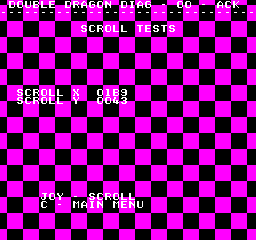

# Scroll Tests
---
There is hardware support for scrolling the background layer.  The background
layer is 512x512 pixels in size.  Scrolling is handled by setting an X and Y
offset that sets the view port into the background layer.  The background layer
has seamless edges, such that if you scroll off the side it will wrap around to
the other side.

The range of the offset values is 0 to 512, which is 9 bits.  The lower 8 bits
are written to REG_SCROLLX ($3809) and REG_SCROLLY ($380a).  The 9th bit is
handled by writing to REG_BANKSWITCH ($3808), with bit 0 being for scroll x,
and bit 1 for scroll y.

The Scroll Tests consists of filling the entire background layer with a
checkerboard of magenta tiles.  The current scroll X and Y offsets are printed
on screen in hex.  The joystick can then be used to scroll the background.

If scrolling is not smooth its an indication of a problem.
