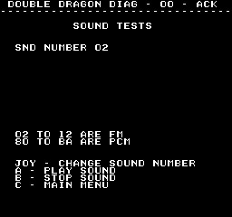

# Sound Tests
---
The Double Dragon has a separate CPU for handling sound.  The main CPU is able
to send a single byte to the sound CPU.  Depending on what this byte is a sound
will play.  The sounds tests allows you to send any byte to the sound CPU,
sending this byte will also trigger an IRQ (pin 3) on the sound CPU.

The sound subsystem supports both FM and PCM sounds.

FM sounds are 0x02 to 0x12 
PCM sounds are 0x80 to 0xBA

#### FM Sounds
If you have an audio probe, when playing a FM sound you should be able to hear
it on the follow pins

YM2151 pin 21 (output) 
YM3012 pin 4 (input) 
YM3012 pin 10,11,12 (outputs)

#### PCM Sounds
When playing a PCM sound you should expect to see the data pins on one of the
PCM roms (IC94/IC95) become active.
