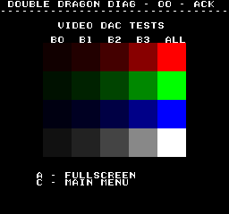

# Video DAC Tests
---
The video DAC test can help track down color issues by giving both an overview
of each of the individual digital input signals and being able to isolate those
input signals.

Double Dragon has 12 bit color, with 4 bits for red, green and blue.  The video
DAC test contains a table of color blocks.  Each bit is given its own block for
red, green, and blue.  The far right column is a summation of the bits for that
row, and the last row is a summation of the bits for that column.

This gives a quick view in identifying if one of a color's bits is dead/stuck.

Its also possible to go into full screen mode, which will fill the entire screen
with a color block from the table.  It will start out on red bit 0.  You can
use the joystick to navigate to different colors from the table.  The C button
will return to the table screen.
